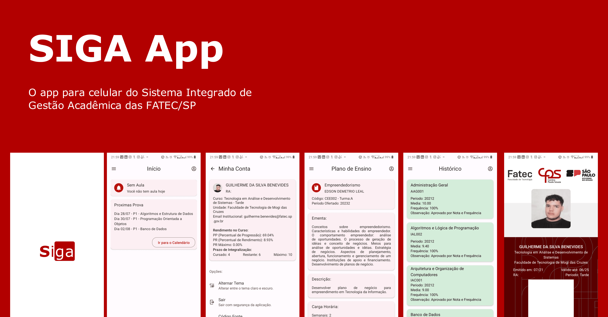

<h1 align="center">
    
</h1>
<p align="center">


</p>
<p align="justify">
Aplicativo de celular para acesso dos alunos ao <a href="https://siga.cps.sp.gov.br/ALUNO/login.aspx">SIGA</a>(Sistema Integrado de Gestão Acadêmica) das <a href="https://www.cps.sp.gov.br/fatec/">FATEC</a>(Faculdades de Tecnologia) do estado de São Paulo. Este app é um cliente não oficial, não possuí vínculo com o <a href="https://www.cps.sp.gov.br">CPS</a>(Centro Paula Souza) ou com as FATEC's. O objetivo deste app é facilitar o acesso ao SIGA, que não possui um aplicativo oficial.
</p>
<p align="center">
  <a href="https://www.youtube.com/watch?v=ytzxcE75XYg">
  
  Veja esse video demonstração!
  </a>
</p>
<h2>👨‍💻 Tecnologias Utilizadas</h2>
<ul>
<li><b><a href="https://reactnative.dev/">React Native</a></b> Plataforma para desenvolvimento de apps para mobile, com suporte a Android e IOS, utilizando o framework React.</li>
<li><b><a href="https;//expo.dev/">Expo</a></b> Plataforma para facilitar e acelerar o desenvolvimento de apps em React Native.</li>
<li><b><a href="https://www.typescriptlang.org/">Typescript</a>:</b> Linguagem de programação baseada em JavaScript.</li>
<li><b><a href="https://axios-http.com/ptbr/docs/intro">Axios</a>:</b> Cliente HTTP baseado em Promises para fazer requisições.</li>
<li><b><a href="https://yarnpkg.com/">Yarn</a>:</b> Gerenciador de pacotes.</li>
<li><b><a href="https://nodejs.org/en/">NodeJS</a>:</b> Ambiente de execução JavaScript.</li>
<li><b><a href="https://reactnativepaper.com/">React Native Paper</a></b> Biblioteca para estilização de apps em React Native utilizando o Material Design da Google.</li>
<li><b><a href="https://reactnavigation.org/">React Native Navigation</a></b> Biblioteca de navegação e roteamento de telas para React Native.</li>
<li><b><a href="https://github.com/gsbenevides2/siga-fatec">Siga Fatec</a>:</b> Uma lib desenvolvida por mim para realizar rapagem de informações do SIGA através de requisição HTTP.</li>
</ul>

<h2>📦 Como Baixar (Para Não Devs)</h2>
<p align="justify">Por questões técnicas, o download da aplicação está disponível somente para android e fora da Google Play Store. Lembre-se de habilitar a instalação de aplicativos de fontes desconhecidas.Use o <a href="https://github.com/gsbenevides2/siga-app/releases/tag/1.0.0"> link</a> para fazer download do APK.</p>

<h2>📦 Como Baixar (Para Devs)</h2>
<p>Para baixar o projeto, faça um clone desse repositório, execute o seguinte comando no seu terminal:</p>

```bash
yarn
yarn start
```

<p>Apos isso instale o <a href="">Expo Go</a> em seu celular. E faça a leitura do QR Code que aparecer no termina.</p>

<h2>📃 Licença</h2>
<p>Este projeto está sobre a licença MIT. Veja ela em: <a href="LICENSE">LICENSE</a>.</p>

<hr>
<p align="center">Feito com ❤️ por <a href="https://gui.dev.br">gsbenevides2</a></p>
